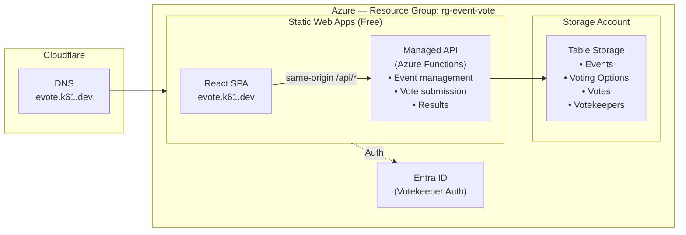

# Event Vote - Development Plan

**Production URL**: https://evote.k61.dev

---

## 1. Overview

A live event voting app where a **Votekeeper** creates an event, adds voting options throughout a session, and opens voting to the audience. Attendees vote from their phones — no login required. Results are revealed dramatically from last place to first.

### Core Flow
1. **Votekeeper** signs in, creates an event
2. **Votekeeper** adds voting options (title + description) throughout the event — this screen is projected
3. **Votekeeper** clicks "Open Voting" to allow audience participation
4. **Attendees** scan a QR code from their phone to access the ballot
5. **Attendees** distribute their votes (default 3) across options — can stack on one or spread out
6. **Votekeeper** closes voting
7. **Votekeeper** triggers result reveal — places are unveiled last-to-first with animation
8. Winner is announced with a celebration effect
9. **Votekeeper** generates a shareable results page / PDF export with charts

### Key Concepts

| Term | Description |
|------|-------------|
| **Votekeeper** | The authenticated user running the event (likely presenting on a projector) |
| **Attendee / Voter** | An audience member voting from their phone (identified by display name, no login required) |
| **Event** | A single voting session with a set of options |
| **Voting Option** | Something attendees can vote for (has title + description) |
| **Vote Allocation** | The number of votes each attendee gets (default 3, configurable) |

---

## 2. Requirements Summary

| Requirement | Value |
|------------|-------|
| Auth (Votekeeper) | Microsoft Entra ID via SWA built-in auth |
| Auth (Attendees) | No login — display name + device fingerprint |
| Max Voting Options | 50 per event |
| Default Votes per Attendee | 3 (configurable by Votekeeper: 1-10) |
| Vote Distribution | Attendee can place all votes on one option or spread across many |
| Live Vote Display | Configurable: hidden, total only (default), or per-option |
| Duplicate Vote Prevention | Device fingerprint + session cookie |
| Real-time Updates | Polling (5-10 second intervals) |
| Results Reveal | Sequential, last-to-first (scavenger-hunt style) |
| Tiebreaker | Unique voters (distinct voterId count, ignoring stacked votes) |
| Vote Changes | Voters can reset/change votes until voting closes |
| Results Export | Shareable results page + PDF export with charts |
| Event Expiration | Events auto-expire after 24 hours |

---

## 3. Event Lifecycle

```
┌──────────┐     ┌───────────┐     ┌────────┐     ┌──────────┐     ┌───────────┐     ┌──────────┐
│ Created  │────▶│  Setup    │────▶│  Open  │────▶│  Closed  │────▶│ Revealing │────▶│ Complete │
└──────────┘     └───────────┘     └────────┘     └──────────┘     └───────────┘     └──────────┘
      │               │                │                │                │                │
  Event created   Add/edit         Voting is        Voting is        Results shown     All results
  by Votekeeper   voting options   open to          closed           last-to-first     revealed
                  (projected)      attendees
```

### Status Definitions

| Status | Votekeeper Can... | Attendees Can... |
|--------|-------------------|------------------|
| **setup** | Add/edit/remove voting options, configure vote allocation | See event page (no voting yet) |
| **open** | See live vote display (based on config), add/delete options, close voting | Cast votes, see options |
| **closed** | Trigger reveal | See "Voting closed" message |
| **revealing** | Click to reveal each place one at a time | Watch the reveal |
| **complete** | See final results, generate shareable report / PDF | See final results, view/download report |

---

## 4. User Flows

### Votekeeper Flow

```
1. Sign in with Microsoft
2. See dashboard (list of past events, "Create Event" button)
3. Click "Create Event"
   - Enter event title (prominently displayed on all views — projector, ballot, results)
   - Set votes per attendee (default 3)
   - Set live vote display mode (hidden / total / per-option)
4. Enter Setup view (projectable)
   - Large, clean UI suitable for projection
   - Add voting options (title + description)
   - QR code visible in corner/header (links to voter page)
   - Event join code displayed for manual entry
5. Click "Open Voting"
   - QR code becomes prominent
   - Live vote display based on config:
     - **Hidden**: No counts shown (blind vote)
     - **Total only** (default): Shows "47 votes cast" — builds excitement without influencing
     - **Per-option**: Shows count next to each option — fun but can create bandwagon effect
   - Can add or delete options while voting is open (voters see changes via polling)
6. Click "Close Voting"
7. Click "Reveal Results"
   - Each place revealed one at a time (last → first)
   - Click/tap or auto-advance to reveal next
   - Winner gets celebration animation
8. Click "Generate Report"
   - Shareable results page with anonymized vote breakdowns and charts
   - PDF export option for debriefs
   - Includes: event title, all options ranked, vote counts, unique voter counts, charts
```

### Attendee (Voter) Flow

```
1. Scan QR code or enter URL + event code
2. Enter display name (stored in session — not an account, just identification)
3. See event title prominently + list of voting options (title + description)
4. Allocate votes
   - Each option has +/- buttons
   - Remaining votes counter shown prominently
   - "Reset" button to clear all allocations and start over
   - "Submit Votes" button (disabled until at least 1 vote placed)
5. Submit votes → see confirmation
6. Can return and change votes at any time while voting is open
   - Re-scan QR code or refresh → session restored → see current allocations → edit and resubmit
7. When voting closes → automatically redirected to waiting page
8. Watch results reveal (same reveal view as projector)
9. View/download the results report
```

### Reconnect Flow (Voter Disconnect Recovery)

```
1. Voter loses connection or closes browser during voting
2. Voter re-scans QR code or navigates back to event URL
3. Session restored from localStorage (voterId + display name)
4. If votes were previously submitted → shows current allocations, editable
5. If votes were not yet submitted → shows empty ballot
6. Voter can continue voting normally
```

---

## 5. Architecture



**Architecture Notes:**
- **SWA Managed API** — Functions deployed within the SWA resource; SWA securely injects `x-ms-client-principal` for authenticated requests
- **SWA Free Tier** — Hosts the React SPA + managed API at no cost
- **Separate Resource Group** — `rg-event-vote` keeps all resources isolated from other projects
- **No CORS needed** — API calls are same-origin (`/api/*` routed internally)
- **Auth** — SWA built-in auth handles Entra ID sign-in; managed API receives verified auth headers
- **Cloudflare DNS** — CNAME pointing to SWA hostname (proxy disabled for SSL compatibility)
- **No Blob Storage** — Text-only data, no media uploads needed

*Note: SignalR omitted — using polling for real-time updates instead.*

---

## 6. Azure Cost Estimate

### Resource Breakdown

| Resource | Purpose | Pricing Model | Estimated Monthly Cost |
|----------|---------|---------------|------------------------|
| **Azure Static Web Apps (Free)** | Host React SPA | Free tier | $0.00 |
| **SWA Managed API (Functions)** | API endpoints | Included in SWA Free tier | $0.00 |
| **Azure Storage Account** | Table Storage for all data | $0.00036/10K transactions + $0.045/GB | < $0.01 |
| **Entra ID** | Votekeeper authentication | Free (included with Azure) | $0.00 |
| **Custom Domain** | Subdomain of existing domain | Already owned | $0.00 |

### Storage Calculations

**Table Storage (per event):**
- 1 Event record: ~500 bytes
- 50 Voting Options × ~500 bytes: ~25 KB
- 500 Voters × ~200 bytes per vote record: ~100 KB
- **Total per event: ~125 KB** → thousands of events = still < 1 MB

### Cost Summary

| | Monthly | Annual |
|-|---------|--------|
| **Total** | ~$0.00 | ~$0.00 |

**Bottom line: Effectively free.** SWA Free tier + Consumption Functions + Table Storage = negligible cost. All resources live in a dedicated `rg-event-vote` resource group, fully isolated from other projects.

---

## 7. Data Model

### Event
```typescript
interface Event {
  id: string;                    // Auto-generated 4-letter code (e.g., "ABXK"), filtered against offensive word blocklist
  name: string;                  // Event title — displayed prominently on all views (e.g., "Best Team Costume")
  createdBy: string;             // Votekeeper's user ID
  createdAt: string;             // ISO date
  status: 'setup' | 'open' | 'closed' | 'revealing' | 'complete';
  config: {
    votesPerAttendee: number;    // Default 3, configurable 1-10
    liveVoteDisplay: 'hidden' | 'total' | 'per-option';  // Default 'total'
  };
  openedAt?: string;             // When voting was opened
  closedAt?: string;             // When voting was closed
  expiresAt: string;             // Auto-expire after 24 hours
}
```

### Voting Option
```typescript
interface VotingOption {
  id: string;                    // Unique option ID
  eventId: string;               // Parent event
  title: string;                 // Max 100 chars
  description: string;           // Max 500 chars
  order: number;                 // Display order
  createdAt: string;
  voteCount?: number;            // Populated after voting closes (or live if showLiveCount)
}
```

### Vote
```typescript
interface Vote {
  id: string;                    // Unique vote record ID
  eventId: string;               // Parent event
  optionId: string;              // Which option was voted for
  voterId: string;               // Device fingerprint / session ID
  voterName: string;             // Display name entered by voter
  count: number;                 // How many votes placed on this option (1+)
  submittedAt: string;
  updatedAt?: string;            // Last time votes were changed
}
```

### Voter Session (localStorage)
```typescript
interface VoterSession {
  eventId: string;
  voterId: string;               // Generated fingerprint + random component
  voterName: string;             // Display name entered on first visit
  votesSubmitted: boolean;       // Whether votes have been cast
  allocations?: Record<string, number>;  // Current vote allocations (optionId → count)
  submittedAt?: string;
}
```

**Session Behavior:**
| Scenario | Behavior |
|----------|----------|
| Page refresh before voting | ✅ Session + name restored, can still vote |
| Page refresh after voting | ✅ Session restored, can edit and resubmit votes (while open) |
| Re-scan QR code | ✅ Session restored, see current allocations |
| Disconnect + reconnect | ✅ Submitted votes restored from server, editable until closed |
| Different device/browser | Can vote again (device fingerprint differs) — acceptable trade-off |
| Event expired/deleted | Clear session, show "event not found" |
| Voting not yet open | Shows options list with "Voting hasn't started yet" |
| Voting closed while editing | Redirect to waiting page, last-submitted votes count |

### Votekeeper (Allowlist)
```typescript
interface Votekeeper {
  email: string;                 // Primary key (lowercase)
  displayName: string;           // From Microsoft profile
  addedBy: string;               // Email of who invited them
  addedAt: string;
}
```

---

## 8. Table Storage Schema

### PartitionKey / RowKey Design

| Table | PartitionKey | RowKey | Description |
|-------|-------------|--------|-------------|
| **Events** | `event` | `{eventId}` | Event record |
| **VotingOptions** | `{eventId}` | `option_{optionId}` | Options for an event |
| **Votes** | `{eventId}` | `vote_{voterId}_{optionId}` | Individual vote records |
| **Votekeepers** | `votekeeper` | `{email}` | Authorized votekeepers |

**Query Patterns:**
- Get event: Point query on Events table
- Get all options for event: Partition scan on VotingOptions
- Get all votes for event: Partition scan on Votes (for tallying)
- Check if voter already submitted: Partition scan with voterId prefix filter

---

## 9. API Endpoints

### Event Management (Votekeeper Only)
```
POST   /api/events                     Create new event
GET    /api/events                     List my events
GET    /api/events/:id                 Get event details (Votekeeper view)
PATCH  /api/events/:id                 Update event config
DELETE /api/events/:id                 Delete event and all associated data
```

### Event Lifecycle (Votekeeper Only)
```
POST   /api/events/:id/open            Open voting
POST   /api/events/:id/close           Close voting
POST   /api/events/:id/reveal          Start/advance results reveal
POST   /api/events/:id/complete        Finalize event (mark complete)
```

### Voting Options (Votekeeper Only)
```
POST   /api/events/:id/options         Add voting option
PUT    /api/events/:id/options/:optId  Update voting option
DELETE /api/events/:id/options/:optId  Remove voting option (setup or open — votes for deleted options discarded)
PATCH  /api/events/:id/options/reorder Reorder options
```

### Public / Attendee Endpoints
```
GET    /api/events/:id/public          Get event info + options (no auth required)
POST   /api/events/:id/vote            Submit or update votes (no auth required, idempotent by voterId)
GET    /api/events/:id/vote/:voterId   Get current vote allocations for a voter (reconnect support)
GET    /api/events/:id/results         Get results (available after reveal starts)
GET    /api/events/:id/results/status  Poll for reveal progress
GET    /api/events/:id/report          Get shareable results report data (available after complete)
GET    /api/events/:id/report/pdf      Download PDF export (generated server-side once, cached for all)
```

### Votekeeper Management (Votekeeper Only)
```
GET    /api/votekeepers                List all votekeepers
POST   /api/votekeepers                Invite new votekeeper (by email)
DELETE /api/votekeepers/:email         Remove votekeeper
GET    /api/me                         Get current user's auth + votekeeper status
```

### Security
- **Rate Limiting**: Vote submission — 5 requests per IP per minute to prevent abuse
- **Device Fingerprint**: Combines browser characteristics + random session ID
- **Vote Validation**: Server-side check that total votes ≤ configured allocation
- **Event Codes**: Auto-generated 4-letter codes, filtered against offensive word blocklist

---

## 10. Frontend Views

### Tech Stack
- **React** with TypeScript
- **Vite** for build tooling
- **Tailwind CSS** for styling
- **React Router** for navigation
- **TanStack Query** for data fetching + polling

### View Hierarchy

```
App
├── / (Landing page — join an event or sign in)
├── /join/:eventId (Attendee ballot view)
│   ├── Name Entry (enter display name)
│   ├── Waiting (voting not open yet)
│   ├── Voting (allocate + submit + reset + change votes)
│   ├── Closed / Waiting (voting closed, waiting for reveal)
│   └── Results (reveal animation + report download)
├── /dashboard (Votekeeper — list events)
├── /event/:eventId (Votekeeper — main event management view)
│   ├── Setup (add/edit options, projectable)
│   ├── Voting Open (live status, QR code prominent)
│   ├── Closed (ready to reveal)
│   ├── Revealing (click-to-reveal, last-to-first)
│   └── Complete (final results + generate report)
├── /results/:eventId (Public shareable results page — no auth)
└── /settings (Votekeeper management)
```

### Projector-Friendly Design
The Votekeeper's event view (`/event/:eventId`) is designed to be projected:
- **Large fonts** — readable from the back of the room
- **High contrast** — dark background with bright text
- **QR code** — always visible, sized for scanning from a distance
- **Minimal chrome** — no navigation bars or clutter during the event
- **Responsive** — works on both projector and Votekeeper's laptop screen

### Attendee Mobile Design
The voter view (`/join/:eventId`) is mobile-first:
- **Touch-friendly** — large tap targets for +/- vote buttons
- **Simple layout** — option list with vote allocation controls
- **Remaining votes counter** — sticky at top or bottom
- **Single scroll** — all options visible in one scrollable list
- **No login** — enter display name and land on the ballot
- **Vote management** — reset button to clear allocations; change votes after submitting (while open)
- **Reconnect-friendly** — session restores on re-scan or page refresh

---

## 11. Anti-Fraud / Duplicate Vote Prevention

Since attendees don't log in, we use a multi-layered approach:

### Device Fingerprint
- Combine browser characteristics (user agent, screen size, language, timezone, etc.)
- Hash into a stable fingerprint
- Not perfectly unique, but a reasonable deterrent

### Session Cookie
- Set an HttpOnly cookie on vote submission
- Server checks for existing cookie on `/api/events/:id/vote`
- Prevents simple re-submissions from same browser

### Server-Side Validation
- Total votes per voter ≤ `votesPerAttendee`
- Resubmission from same `voterId` replaces previous votes (supports vote changes)
- Rate limit by IP address

### Accepted Trade-offs
- A determined user could vote from multiple devices — this is acceptable for a fun event context
- Incognito mode could bypass cookie check — fingerprint still provides some protection
- This is **not** a secure election system — it's a fun audience participation tool

---

## 12. Results Reveal (Scavenger Hunt Style)

The reveal follows the same pattern as the scavenger-hunt project:

### Reveal Mechanics
1. Votekeeper clicks "Reveal Results"
2. Event status changes to `revealing`
3. Results are sorted by vote count (ascending — worst first)
4. **Tiebreaker**: if two options have the same vote count, the one with more **unique voters** ranks higher (e.g., 6 votes from 4 unique people beats 6 votes from 2 people who stacked)
5. Each option is revealed one at a time with animation
6. New items appear at the top of the list (pushing others down)
7. Votekeeper clicks/taps to advance to the next reveal
8. Top 3 get medal icons (gold, silver, bronze)
9. After all revealed, winner gets a celebration banner
10. "Generate Report" button appears for Votekeeper

### Reveal Animation (CSS)
- Items slide in from below with a fade
- Brief pause between reveals for drama
- Winner reveal has extra flourish (glow, larger card, confetti optional)

### Reveal State
```typescript
interface RevealState {
  revealedCount: number;         // How many have been shown so far
  totalOptions: number;          // Total options to reveal
  isComplete: boolean;           // All options revealed
}
```

The reveal progress is tracked server-side so attendees watching on their phones see the same progression as the projector.

### Results Report
After reveal is complete, the Votekeeper can generate a shareable report:
- **Shareable URL** — public link to a read-only results page (no auth required)
- **PDF Export** — downloadable PDF with charts and vote breakdowns
- **Report Contents**:
  - Event title and date
  - All options ranked by final position
  - Vote counts and unique voter counts per option
  - Bar chart or horizontal bar visualization
  - Anonymized breakdown (no voter names in report)
  - Total voters and total votes cast
- **Chart Library** — Recharts (or Chart.js) for the web view; pdf-lib for server-side PDF generation in Azure Functions
- **PDF Caching** — PDF generated once on first request, cached and served to all subsequent downloads

---

## 13. QR Code

- Generated client-side using a QR code library (e.g., `qrcode.react`)
- Encodes the attendee URL: `https://evote.k61.dev/join/{eventId}`
- Displayed prominently on the Votekeeper's projected view
- Sized appropriately for scanning from a distance (at least 200×200px on screen)
- Event join code displayed below QR for manual entry fallback

---

## 14. Polling Strategy

Since we're using polling instead of real-time WebSockets:

| View | Polls | Interval | What's Polled |
|------|-------|----------|---------------|
| Votekeeper (setup) | No | — | Manual refresh only |
| Votekeeper (open) | Yes | 5s | Vote counts per option |
| Votekeeper (revealing) | No | — | Votekeeper drives the reveal |
| Attendee (waiting) | Yes | 5s | Event status (waiting for "open") |
| Attendee (voting) | Yes | 10s | Event status (detect if voting was closed → redirect to waiting) |
| Attendee (submitted) | Yes | 5s | Event status (waiting for "revealing" or "closed" → redirect) |
| Attendee (results) | Yes | 3s | Reveal progress (how many revealed) |

---

## 15. Project Structure

```
event-vote/
├── .github/
│   ├── copilot-instructions.md
│   └── workflows/
│       └── deploy.yml
├── docs/
│   ├── plan.md                  # This file
│   ├── DEPLOYMENT.md
│   └── DEVELOPMENT.md
├── functions/
│   ├── host.json
│   ├── local.settings.json
│   ├── local.settings.json.template
│   ├── package.json
│   ├── tsconfig.json
│   └── src/
│       ├── functions/
│       │   ├── events.ts        # Event CRUD + lifecycle
│       │   ├── options.ts       # Voting option management
│       │   ├── vote.ts          # Vote submission
│       │   ├── results.ts       # Results + reveal + report generation
│       │   ├── votekeepers.ts   # Votekeeper management
│       │   └── me.ts            # Auth status
│       ├── services/
│       │   ├── eventService.ts
│       │   ├── voteService.ts
│       │   ├── tableStorageService.ts
│       │   ├── reportService.ts # Report data + server-side PDF generation (pdf-lib)
│       │   └── codeGenerator.ts # 4-letter event code generation + offensive word filter
│       └── utils/
│           ├── auth.ts
│           └── validation.ts
├── infra/
│   └── main.bicep               # SWA (Free) + Storage Account
├── web/
│   ├── index.html
│   ├── package.json
│   ├── tsconfig.json
│   ├── vite.config.ts
│   └── src/
│       ├── App.tsx
│       ├── main.tsx
│       ├── index.css
│       ├── components/
│       │   ├── common/          # Shared components
│       │   ├── landing/         # Landing page
│       │   ├── dashboard/       # Votekeeper dashboard
│       │   ├── event/           # Votekeeper event management
│       │   │   ├── SetupView.tsx
│       │   │   ├── VotingOpenView.tsx
│       │   │   ├── RevealView.tsx
│       │   │   └── ResultsView.tsx
│       │   └── voter/           # Attendee views
│       │       ├── BallotView.tsx
│       │       ├── NameEntryView.tsx
│       │       ├── WaitingView.tsx
│       │       └── VoterResultsView.tsx
│       ├── hooks/
│       ├── services/
│       └── types/
├── tests/
│   ├── unit/                    # Unit tests (Vitest)
│   │   ├── functions/           # API function tests
│   │   └── web/                 # Component + hook tests
│   └── smoke/                   # Smoke tests (Playwright)
├── staticwebapp.config.json
├── README.md
└── .gitignore
```

---

## 16. Implementation Phases

### Phase 1: Foundation
- [x] Project scaffolding (React + Vite + Tailwind + Azure Functions)
- [x] Infrastructure (Bicep for SWA Free + Storage + Functions in `rg-event-vote`)
- [x] Auth setup (Entra ID + Votekeeper allowlist)
- [x] Basic event CRUD API (with prominent event title)
- [x] Votekeeper dashboard + create event flow
- [x] Local dev setup (`start-dev.ps1` / `start-dev.sh`)
- [x] Unit test setup (Vitest for functions + components)

### Phase 2: Core Voting
- [x] Voting option management (add/edit/remove/reorder)
- [ ] Projector-friendly setup view (prominent event title)
- [x] QR code generation
- [x] Voter name entry
- [x] Attendee ballot view (mobile-first, vote reset + change)
- [x] Vote submission API with anti-fraud (idempotent upsert by voterId)
- [x] Voter reconnect / session restore
- [x] Event lifecycle (open → close → reveal → complete)
- [x] Unit tests for vote service + anti-fraud logic

### Phase 3: Results Reveal
- [x] Vote tallying API (with unique voter tiebreaker)
- [x] Reveal state management (server-side tracking)
- [x] Last-to-first reveal animation (scavenger-hunt style)
- [x] Medal icons for top 3
- [x] Winner celebration banner
- [x] Attendee results view (synced with reveal)
- [x] Shareable results page (public URL, no auth)
- [x] PDF export with charts (anonymized vote breakdowns)

### Phase 4: Polish & Deploy
- [x] Polling for live updates
- [x] Error handling + edge cases (disconnect recovery, voting closed mid-edit)
- [x] Mobile responsiveness fine-tuning
- [x] Event expiration / cleanup
- [ ] Smoke tests (Playwright — create event, vote, reveal flow)
- [x] CI/CD pipeline (GitHub Actions — build + unit tests + smoke tests)
- [x] Deployment to Azure
- [x] README + docs

---

## 17. Testing Strategy

### Unit Tests (Vitest)
- **API Functions**: Test each endpoint's logic — validation, auth checks, vote tallying, tiebreaker sorting
- **Services**: Test vote service (upsert, allocation limits, unique voter count), event lifecycle transitions
- **Components**: Test key UI components — ballot view, vote allocation controls, results reveal
- **Hooks**: Test custom hooks — polling, session management, vote state

### Smoke Tests (Playwright)
- **Full flow**: Create event → add options → open voting → vote from mobile viewport → close → reveal → report
- **Reconnect**: Vote, close browser, re-open → verify session restores
- **Edge cases**: Vote during close transition, multiple voters

### CI/CD
- Unit tests run on every push/PR
- Smoke tests run on deploy to staging

---

## 18. Resolved Questions

- [x] **Votekeeper can add/delete voting options after voting has opened.** Voters see new options appear (via polling). Deleted options have their votes discarded.
- [x] **Single voting round per event.** Multiple rounds not planned for MVP.
- [x] **Event codes are auto-generated 4-letter codes** (e.g., "ABXK"). Not customizable. Filtered against a blocklist to avoid offensive combinations.
- [x] **PDF generation is server-side.** Generated once via pdf-lib (or similar) in Azure Functions, stored as a cached response. All users download the same file via `GET /api/events/:id/report/pdf`.
